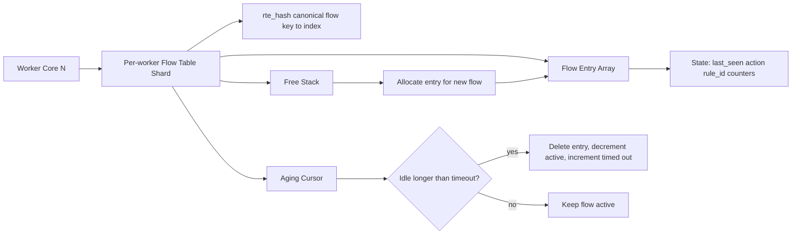
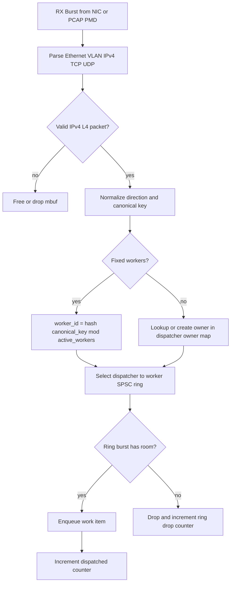
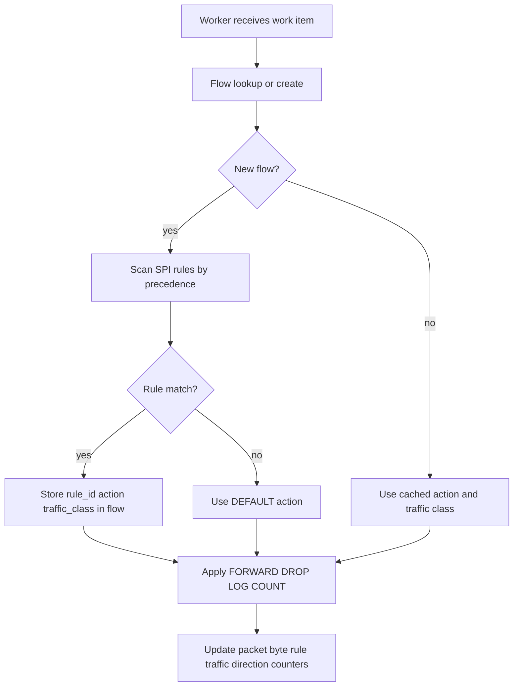
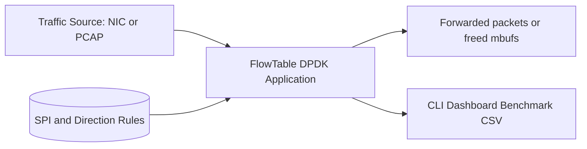
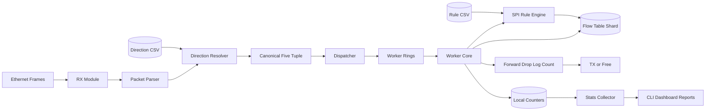
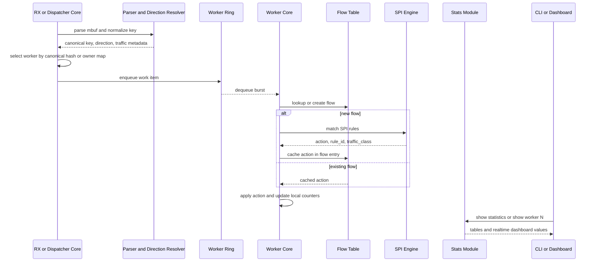
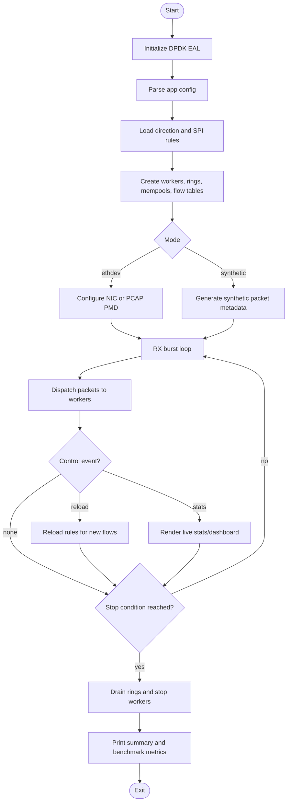
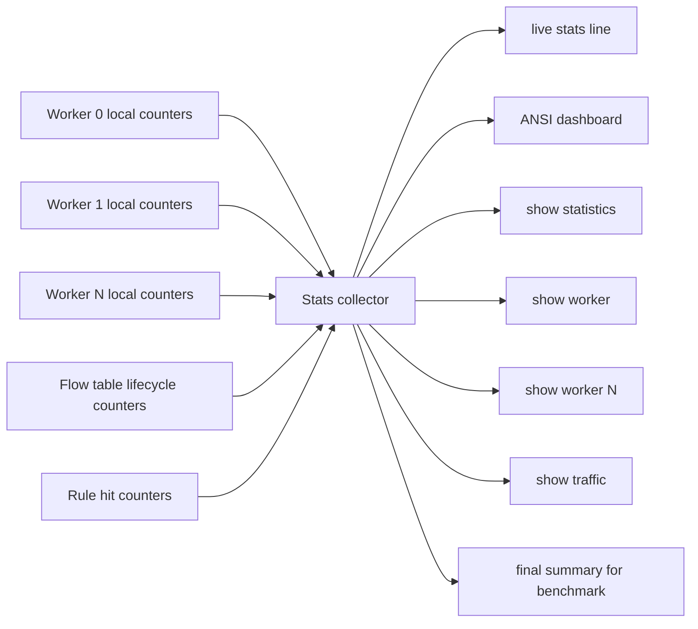

# Design Diagrams

Các block dưới đây là Mermaid code, có thể render trực tiếp trên GitHub,
Mermaid Live Editor hoặc các công cụ hỗ trợ Mermaid. Nội dung bám theo
implementation hiện tại trong repo.

## Flow Table Design

## Dispatcher Algorithm

## SPI Rule Engine

## Data Flow Diagram Level 0

## Data Flow Diagram Level 1

## Packet Processing Sequence

## Application Activity Diagram

## Realtime Statistics Data Path

